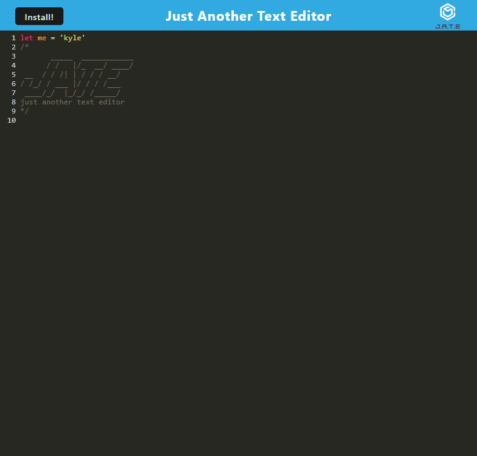

# PWA Text Editor

## Description

- This project is a progressive web application (PWA) text editor. This allows the user to create their code snippets or texts while they are connected or not connected to the Internet. Additionally, the user will be able to retrieve their past work when the application is reopened.

## Usage

- To use this application, head over to: [https://text-editor-6brc.onrender.com/](https://text-editor-6brc.onrender.com/)
  - You can interact with the text editor while in the browser, or you can also install the application by pressing the "Install" button in the top left

* If you choose to clone this repo, you must first run the following command in the root directory to install the necessary dependencies:

  ```
  npm run i
  ```

* To start running this application, you must run the following command:

  ```
  npm run start
  ```

* Then you may be able to go to `http://localhost:3000/` on your browser of choice

## Preview

Here is a preview of the PWA:


